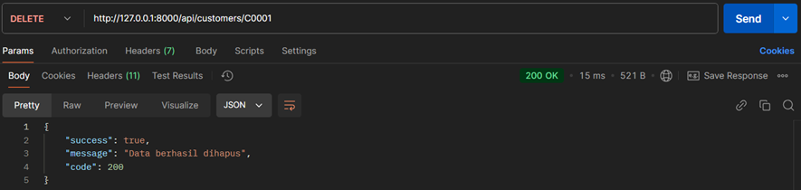

# Vania Dart backend framework

NAMA SAYA ZIDNIY

CUSTOMERS
1. Create

2. Read

3. Update

4. Delete

VENDORS
1. Create

2. Read

3. Update

4. Delete

PRODUCTS
1. Create

2. Read

3. Update

4. Delete

VENDORS
1. Create

2. Read

3. Update

4. Delete

VENDORS
1. Create

2. Read

3. Update

4. Delete

