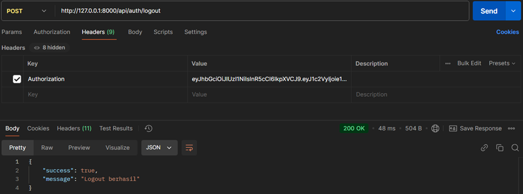

# TUGAS PAML - VANIA REST API

<h4>NAMA : ZIDNIY FARIH AL KAUSAR</h4>
<h4>NIM : 5210411096</h4>

<b>CUSTOMERS</b>
1. Create

2. Read

3. Update

4. Delete

<b>VENDORS</b>
1. Create

2. Read

3. Update

4. Delete

<b>PRODUCTS</b>
1. Create

2. Read

3. Update

4. Delete

<b>PRODUCTNOTES</b>
1. Create

2. Read

3. Update

4. Delete

<b>ORDERS</b>
1. Create

2. Read

4. Delete

<b>AUTH</b>
1. Login

2. Register

3. Logout

